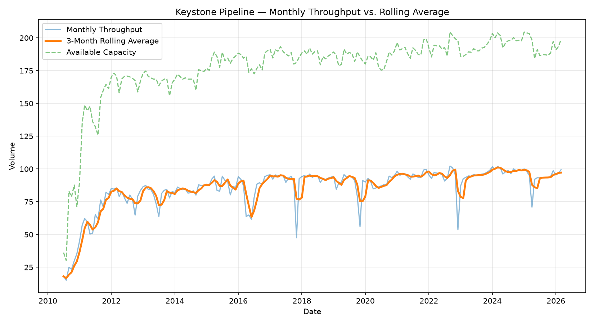
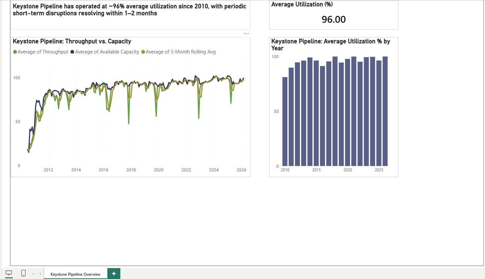

# Pipeline Throughput Analysis

A small Python data analysis project examining monthly crude oil pipeline
throughput and available capacity, using real public data from the
[Canada Energy Regulator (CER)](https://www.cer-rec.gc.ca/) open data portal.



## Power BI Dashboard



An interactive Power BI dashboard built on the same cleaned dataset, showing throughput vs. capacity trends, average utilization, and year-over-year utilization comparison. The `.pbix` file is included in this repository.

## What this does

- Downloads the Keystone Pipeline throughput & capacity dataset directly from CER's open data CSV
- Cleans and standardizes the raw data (handles inconsistent column naming, missing values, type coercion)
- Aggregates to monthly totals and calculates a 3-month rolling average
- Calculates pipeline utilization (throughput / available capacity) and flags the largest
  month-over-month utilization swings
- Outputs a chart comparing raw throughput, rolling average, and available capacity
- Writes a plain-text summary of key stats

## Why I built this

I wanted hands-on, verifiable experience with the kind of data analysis used in
demand forecasting and pipeline/commercial analytics roles in the energy sector —
using real regulatory data, not a toy dataset. This project takes raw quarterly
regulatory filings and turns them into a clean, decision-ready view of throughput
trends and capacity utilization.

## How to run it

```bash
git clone https://github.com/<your-username>/pipeline-throughput-analysis.git
cd pipeline-throughput-analysis
pip install -r requirements.txt
python analyze.py
```

Output lands in `output/`:
- `keystone_clean.csv` — cleaned, monthly-aggregated dataset
- `keystone_throughput_chart.png` — throughput vs. rolling average vs. capacity
- `summary_stats.txt` — plain-text summary of key figures

## Data source

CER Pipeline Throughput and Capacity Data (Keystone Pipeline):
https://www.cer-rec.gc.ca/open/energy/throughput-capacity/keystone-throughput-and-capacity.csv

Published under the Open Government Licence – Canada.

## Notes

- Swap `DATA_URL` in `analyze.py` for any other CER pipeline CSV (e.g. TransCanada
  Mainline, Trans Mountain, Alliance) to run the same analysis on a different system —
  the cleaning logic is written to handle minor column-naming differences across files.
- `ROLLING_WINDOW` in `analyze.py` controls the rolling average period (default: 3 months).
